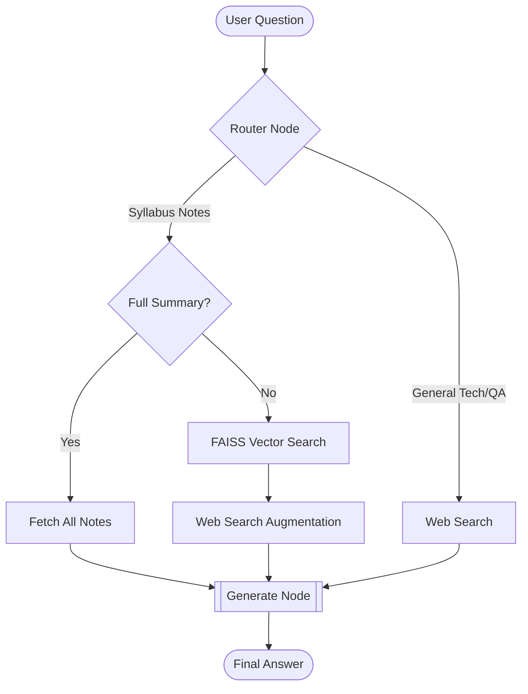

# LangGraph AI Teaching Assistant

A sophisticated, search-augmented Question Answering system built with **LangGraph**, **FAISS**, and **Groq (Llama 3.1)**. This assistant helps students navigate their course syllabus by retrieving internal notes or searching the web for detailed technical explanations.

## 🚀 Key Features

-   **Semantic Search**: Uses FAISS vector database to map natural language questions to the correct week in the syllabus.
-   **Intelligent Routing**: Automatically decides whether to use internal notes (Syllabus Path) or general knowledge (Direct Path).
-   **Web Augmentation**: Integrates DuckDuckGo search to provide deep-dive technical explanations that go beyond basic syllabus titles.
-   **Strict Grounding**: When answering syllabus questions, the AI is constrained to only use provided information to avoid hallucinations.
-   **Automated Summaries**: Can generate a comprehensive overview of the entire course on demand.

## 📊 Project Workflow

The application follows a modular, state-managed pipeline:

1.  **Input**: The user submits a question through the system.
2.  **Router**: An LLM-based router analyzes the query. It categorizes it as either a **Syllabus Note** request (metadata/summary) or a **Direct Knowledge** request (explanations/how-to).
3.  **Processing Paths**:
    *   **Syllabus Path**: The system uses **FAISS** to semantically search the course notes. If a match is found, it augments the data with a **DuckDuckGo** web search for technical context.
    *   **Direct Path**: The system performs a real-time web search to answer technical "how-to" or general knowledge questions that aren't contained in the syllabus notes.
4.  **Synthesis**: The **Generator** (Groq/Llama 3.1) receives the context and the question. It synthesizes a final response, applying strict grounding if it's a syllabus-related answer.
5.  **Output**: The final, verified answer is returned to the user.

## 📈 Workflow Diagram



## 🛠️ Setup & Installation

### 1. Prerequisites
- Python 3.10+
- A Groq API Key (Get one at [console.groq.com](https://console.groq.com/))

### 2. Install Dependencies
```bash
pip install langchain-community faiss-cpu langchain-huggingface langchain-groq langgraph duckduckgo-search python-dotenv
```

### 3. Environment Configuration
Create a `.env` file in the root directory and add your Groq key:
```env
GROQ_API_KEY=your_actual_key_here
```

## 💻 How to Run

1.  Open `main.py`.
2.  Add your queries to the `test_queries` list at the bottom of the file.
3.  Run the script:
```bash
python main.py
```

## 📂 Project Structure
-   `main.py`: The core LangGraph application and node definitions.
-   `.env`: Environment variables (API keys).
-   `README.md`: Project documentation.
